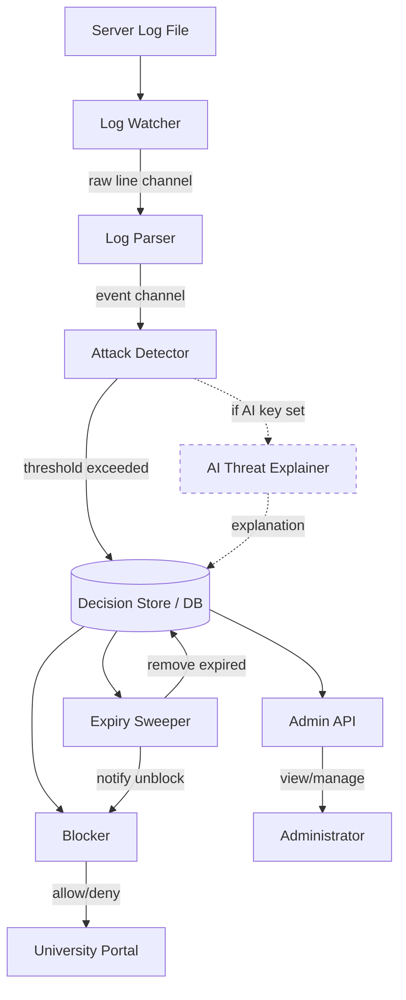

# Architecture — Sentinel Intrusion Detection

---

## Overview

Sentinel is a single-process intrusion detection and prevention system designed for the university portal. Unlike CrowdSec's distributed Agent + LAPI architecture, Sentinel is a monolithic application where the log watcher, parser, detector, decision store, blocker, and admin API all run within a single process. This simplifies deployment for a single-server university portal.

---

## Components

| Component | Responsibility |
|---|---|
| **Log Watcher** | Tails the web server log file and emits raw log lines into the parsing pipeline. |
| **Log Parser** | Transforms raw log lines into structured events (timestamp, IP, event type, username). |
| **Attack Detector** | Maintains per-IP sliding windows. Evaluates scenarios. Creates alerts and ban decisions when thresholds are exceeded. |
| **Decision Store** | Database-backed store of active ban decisions with exact expiration timestamps. |
| **Blocker** | Enforces active bans. Checks the decision store to allow or reject requests. Proactively removes enforcement at expiry. |
| **Admin API** | HTTP API for administrators to view alerts, view active bans, and manage decisions. |
| **AI Threat Explainer** | Optional component that calls an external LLM API to generate human-readable explanations of detected attacks. Requires API key in .env. System runs without it. |
| **Expiry Sweeper** | Periodic background task that proactively removes expired decisions and notifies the Blocker, rather than relying solely on query-time filtering. |

---

## How Components Communicate

All components run in the same process and communicate via in-memory channels or direct function calls:

1. **Log Watcher → Log Parser**: Watcher pushes raw log lines into a channel (inspired by CrowdSec's logLines channel pattern, Evidence: cmd/crowdsec/crowdsec.go:176-177 [Confirmed]).
2. **Log Parser → Attack Detector**: Parser pushes structured events into a second channel.
3. **Attack Detector → Decision Store**: When a scenario triggers, the detector writes an alert + decision directly to the database.
4. **Decision Store → Blocker**: The blocker queries the decision store. The expiry sweeper also pushes removal notifications.
5. **Admin API → Decision Store**: Admin API reads/writes the same database.
6. **Attack Detector → AI Explainer**: On alert creation, if configured, the detector sends alert context to the AI explainer, which calls the external LLM API and stores the explanation.

---

## Data Flow

```
Server log file
      │
      ▼
┌─────────────┐
│ Log Watcher  │  (tails file, emits raw lines)
└──────┬──────┘
       │ raw line channel
       ▼
┌─────────────┐
│ Log Parser   │  (regex/pattern matching → structured event)
└──────┬──────┘
       │ event channel
       ▼
┌──────────────────┐
│ Attack Detector   │  (per-IP sliding window, scenario evaluation)
│                    │
│  threshold met? ──►  Create Alert + Ban Decision
└──────┬───────────┘
       │
       ▼
┌─────────────────┐
│ Decision Store   │  (database: alerts, decisions with expiry)
│ (SQLite/Postgres)│
└──────┬──────────┘
       │
       ├──► Blocker (enforces bans, checks on request)
       │
       ├──► Expiry Sweeper (periodic: removes expired, notifies blocker)
       │
       ├──► Admin API (read/write for admin visibility)
       │
       └──► AI Explainer (optional: generates explanations on new alerts)
```

---

## Mermaid Architecture Diagram



---

## External Services

| Service | Required? | Purpose |
|---|---|---|
| LLM API (e.g., OpenAI, Gemini) | Optional | AI threat explanations. Key in .env. System works without it. |
| Database (SQLite or PostgreSQL) | Required | Stores alerts, decisions, events. |

---

## Where State Lives

- **Database**: All persistent state — alerts, decisions (with expiry), events, configuration.
- **In-memory**: Per-IP sliding window counters in the Attack Detector. These are ephemeral; if the process restarts, windows reset (acceptable for a single-server deployment).
- **.env file**: AI API key and other configuration secrets.

---

## Key Architectural Decisions

### 1. Single-Process Monolith (not Agent + LAPI)

**Decision**: All components run in one process.
**Why**: The university portal is a single server. CrowdSec's distributed architecture (separate agent and LAPI processes, Evidence: cmd/crowdsec/crowdsec.go:28-72 [Confirmed]) is unnecessary complexity for this use case.

### 2. Proactive Expiry Sweeper (not query-time-only expiry)

**Decision**: A background sweeper actively removes expired decisions and notifies the blocker, rather than relying solely on query-time filtering.
**Why**: CrowdSec uses query-time expiry only (WHERE until > now(), Evidence: pkg/database/decisions.go:33 [Confirmed]). This means a bouncer only learns a decision expired when it next polls. Our sweeper ensures bans are lifted exactly when they expire. This is our **Gap Fix** (Improvement 1).

### 3. Per-IP Sliding Window (inspired by leaky bucket)

**Decision**: Use a per-IP sliding time window counter instead of a full leaky-bucket implementation.
**Why**: CrowdSec's leaky bucket is powerful but complex (Evidence: pkg/leakybucket/manager_load.go:29-55 [Confirmed]). For the specific use case of "N failed logins in T seconds," a sliding window is simpler, sufficient, and easier to reason about for the Killer Tests.

### 4. AI Threat Explainer (Differentiator)

**Decision**: Optionally call an LLM to explain detected attacks in human-readable language.
**Why**: CrowdSec has no AI-powered threat explanation feature. This is our **Differentiator** (Improvement 2). The system must work fully without the AI key.

### 5. Channel-Based Pipeline

**Decision**: Use in-memory channels to connect watcher → parser → detector.
**Why**: Inspired by CrowdSec's proven channel architecture (Evidence: cmd/crowdsec/crowdsec.go:176-177 [Confirmed]). Provides clean separation of concerns within a single process.

---

## How the Three Killer Tests Are Supported

### Killer Test 1 (10 failed logins → ban)

The Attack Detector maintains a per-IP sliding window. When the 10th failed login from the same IP arrives within 60 seconds, the detector creates an Alert and a Ban Decision with an expiration timestamp. The decision is stored in the Decision Store.

### Killer Test 2 (innocent bystander isolation)

The per-IP sliding window is keyed by source IP (inspired by CrowdSec's GroupBy expression, Evidence: pkg/leakybucket/manager_run.go:250-263 [Confirmed]). Each IP has its own independent counter. A normal user's IP has its own window that never reaches the threshold.

### Killer Test 3 (exact expiry)

The Expiry Sweeper runs periodically (every few seconds) and removes decisions whose expiration time has passed. Unlike CrowdSec's query-time-only approach, the sweeper proactively notifies the Blocker to stop enforcement. Additionally, the Blocker itself checks the expiration timestamp on every request, ensuring no blocking occurs past expiry even between sweeper runs.
