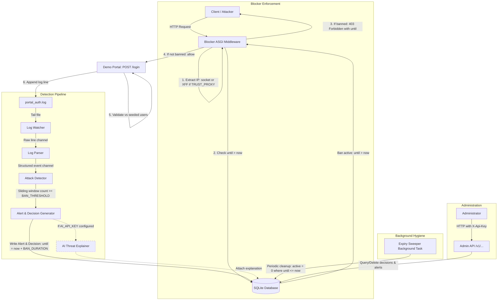

# Architecture — Sentinel Intrusion Detection

---

## Overview

Sentinel is a single-process intrusion detection and prevention system designed for the university portal. Unlike CrowdSec's distributed Agent + LAPI architecture, Sentinel is a monolithic application where the demo portal, blocker middleware, log watcher, parser, detector, decision store, and admin API all run within a single process. This simplifies deployment and guarantees zero-delay, synchronous ban enforcement and exact expiry.

---

## Locked Technology Stack

- **Runtime & Language**: Python 3.11+
- **Web Framework**: FastAPI (with Starlette ASGI middleware & Uvicorn ASGI server)
- **Database**: SQLite (local single-file database accessed via Python standard library `sqlite3` or an async SQLite driver)
- **Testing Suite**: pytest (with `pytest-asyncio` / `httpx` for ASGI endpoint & middleware testing)

---

## Components

| Component | Responsibility |
|---|---|
| **Demo Portal** | FastAPI application hosting simulated university portal endpoints, including `POST /login`. Validates credentials against a seeded demo user list and writes a structured auth log line per attempt to `portal_auth.log`. |
| **Blocker (Middleware)** | FastAPI / ASGI middleware positioned in front of the Demo Portal and other protected routes. On every request, determines client IP, checks SQLite for an active decision (`until > now`), and returns `HTTP 403 Forbidden` with the ban expiry timestamp if banned. |
| **Log Watcher** | Background task that tails the `portal_auth.log` file in real time and emits raw lines into the parsing pipeline. |
| **Log Parser** | Transforms raw log lines into structured events (`timestamp`, `source_ip`, `username`, `result`). |
| **Attack Detector** | Maintains in-memory per-IP sliding windows. Evaluates detection scenarios (`BAN_THRESHOLD` failed logins within `WINDOW_SECONDS`). On threshold breach, generates an Alert and a Ban Decision (`until = now + BAN_DURATION_SECONDS`) and writes them to SQLite. |
| **Decision Store** | SQLite database tables (`event`, `alert`, `decision`) storing active and past decisions with exact expiration timestamps. |
| **Admin API** | Authenticated REST endpoints (`/v1/decisions`, `/v1/alerts`, `/health`, etc.) for administrators to monitor alerts, query active bans, and manually unban IPs. |
| **Expiry Sweeper** | Periodic background cleanup task that marks past decisions (`until <= now`) as inactive (`active = false`) for database hygiene. **Does not control enforcement**; request-time middleware check guarantees exact expiry. |
| **AI Threat Explainer** | Optional component that calls an external LLM API to generate human-readable explanations of detected attacks when `AI_API_KEY` is present. |

---

## Demo Portal Specification

The Demo Portal simulates the target web application (e.g. university result portal):
- **Endpoint**: `POST /login`
- **Request Payload**: JSON with `username` and `password`
- **Seeded User List**: Credential validation checks against a hardcoded in-memory seeded dictionary:
  - `alice:password123`
  - `student:secret2024`
  - `admin:adminpass`
- **Response**:
  - `200 OK` with `{"status": "success", "message": "Login successful"}` if credentials match.
  - `401 Unauthorized` with `{"status": "fail", "detail": "Invalid username or password"}` if credentials do not match.
- **Structured Log Output**: Every login attempt (both success and fail) MUST synchronously append exactly one line to `portal_auth.log` (`LOG_FILE_PATH`).

### Exact Log Line Format

```
{timestamp} | ip={ip} | username={username} | result=success|fail
```

**Field Specifications**:
- **`timestamp`**: ISO 8601 formatted UTC timestamp with timezone indicator: `YYYY-MM-DDTHH:MM:SSZ` (e.g. `2026-10-05T22:30:00Z`).
- **`ip`**: Client IP address determined according to the Client IP Resolution rules below.
- **`username`**: Submitted username (stripped of leading/trailing whitespace, or `anonymous` if omitted).
- **`result`**: Exact literal string `success` (for valid credentials) or `fail` (for invalid credentials).
- **Delimiter**: Space-pipe-space (` | `).

Example log lines:
```
2026-10-05T22:30:00Z | ip=198.51.100.10 | username=student | result=fail
2026-10-05T22:30:05Z | ip=198.51.100.10 | username=student | result=success
```

---

## Blocker Middleware Specification & Exact Expiry

The Blocker is implemented as ASGI middleware running on every HTTP request entering the application:

1. **Client IP Extraction**: On each incoming request, extract the client IP:
   - By default (`TRUST_PROXY=false`), inspect the ASGI connection socket address (`request.client.host`).
   - Only when `TRUST_PROXY=true` in `.env`, inspect the `X-Forwarded-For` header (taking the leftmost / first client IP).
2. **Active Decision Check**: Query the SQLite database:
   ```sql
   SELECT until FROM decision 
   WHERE value = :client_ip 
     AND type = 'ban' 
     AND until > :current_timestamp 
   ORDER BY until DESC LIMIT 1;
   ```
3. **Enforcement**:
   - If an active ban is found (`until > now`): Immediately halt request processing and return `HTTP 403 Forbidden` with a JSON payload containing the ban end time:
     ```json
     {
       "error": "IP is banned",
       "ip": "198.51.100.10",
       "until": "2026-10-05T22:35:00Z"
     }
     ```
   - If no active ban is found (`until <= now` or no record exists): Forward the request down the middleware chain to the Demo Portal or API handler.

### Request-Time Expiry vs. Sweeper Cleanup

A critical architectural distinction in Sentinel:
- **Request-Time Expiry Check Controls Enforcement**: Because the Blocker middleware evaluates `until > now` dynamically on every incoming request, an IP is unblocked **at the exact millisecond** the ban expires. Zero delay, zero polling latency, and no dependency on background task execution.
- **The Expiry Sweeper Only Performs Cleanup**: The background Expiry Sweeper runs periodically (e.g., every 10–30 seconds) and executes:
  ```sql
  UPDATE decision SET active = 0 WHERE active = 1 AND until <= :current_timestamp;
  ```
  The sweeper's sole purpose is database hygiene and keeping `active = 1` indexed queries compact. Even if the sweeper process stops or stalls, requests will never be blocked after `until`.

---

## Configuration (.env)

All runtime parameters are configured via environment variables (loaded via `pydantic-settings` or `python-dotenv`):

| Variable | Default Value | Description |
|---|---|---|
| `BAN_THRESHOLD` | `10` | Number of failed login attempts required to trigger an automatic ban. |
| `WINDOW_SECONDS` | `60` | Sliding time window in seconds during which failed logins are counted. |
| `BAN_DURATION_SECONDS` | `300` | Duration of the ban in seconds (default 5 minutes; short values e.g. 2s used in tests). |
| `LOG_FILE_PATH` | `portal_auth.log` | File path where the Demo Portal writes auth logs and Log Watcher tails. |
| `DATABASE_URL` | `sqlite:///./sentinel.db` | SQLite database connection string or file path. |
| `ADMIN_API_KEY` | `sentinel-admin-secret-key` | API key required for admin management endpoints (`X-Api-Key` header). |
| `AI_API_KEY` | `""` | Optional external LLM API key. If empty or absent, AI explanation is disabled gracefully. |
| `TRUST_PROXY` | `false` | Boolean (`true`/`false`). When `false`, uses connection socket IP; when `true`, parses `X-Forwarded-For`. |

---

## Mermaid Architecture Diagram



---

## How the Three Killer Tests Are Supported

### Killer Test 1 (10 failed logins → Ban)
- Attack Detector maintains in-memory sliding window of failed attempts per IP.
- When 10 failed login events occur within 60 seconds (`WINDOW_SECONDS`), a ban decision is written to SQLite with `until = now + BAN_DURATION_SECONDS`.
- The very next request from that IP is intercepted by Blocker middleware, returning `HTTP 403 Forbidden` with `until`.

### Killer Test 2 (Innocent bystander isolation)
- Sliding windows and SQLite decision records are strictly partitioned by IP (`value = client_ip`).
- Only the attacking IP (`198.51.100.10`) has decision records created.
- Legitimate traffic from a separate IP (`203.0.113.50`) finds no matching record in SQLite and receives `HTTP 200 OK` from the Demo Portal.

### Killer Test 3 (Exact expiry)
- Ban is created with short duration (e.g., 2 seconds).
- While $t < until$, requests from the IP receive `HTTP 403`.
- The moment $t \ge until$, the middleware SQL check `WHERE value = ? AND until > :now` yields 0 results. The request immediately passes through with `HTTP 200 OK`.
- Expiry is exact to the millisecond without relying on the background sweeper.
