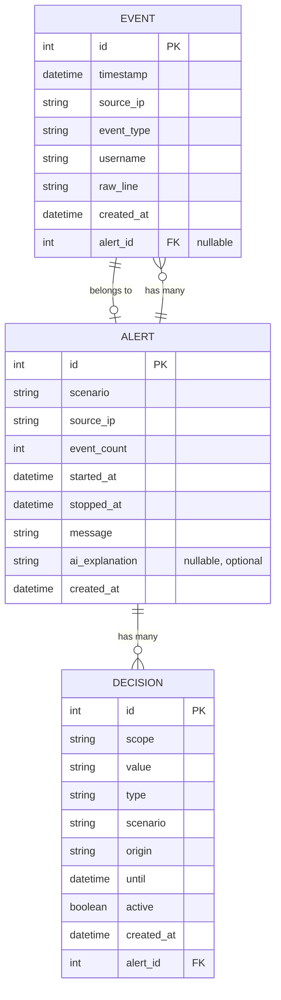

# Data Model — Sentinel Intrusion Detection

---

## Overview

This document defines the minimum data model needed for our rebuild. It does not copy CrowdSec's schema but is informed by the observations. The model is designed to support the three Killer Tests.

---

## ER Diagram



---

## Entities

### 1. EVENT

**Purpose**: Represents a single parsed log event (e.g., one failed login attempt).

| Field | Type | Required | Default | Constraints | Notes |
|---|---|---|---|---|---|
| id | integer | yes | auto-increment | PK | |
| timestamp | datetime | yes | | | When the event occurred in the original log |
| source_ip | string | yes | | indexed | The IP address that generated this event |
| event_type | string | yes | | indexed | e.g., "failed_login", "successful_login" |
| username | string | no | null | | The username involved, if applicable |
| raw_line | text | no | null | | The original raw log line for audit |
| created_at | datetime | yes | now() | immutable | When this record was created |
| alert_id | integer | no | null | FK → ALERT.id | Set when this event is part of an alert |

**Indexes**:
- (source_ip, timestamp) — supports the sliding window query for Killer Test 1
- (event_type) — supports filtering by event type
- (alert_id) — supports retrieving events for an alert

**Relationships**:
- Many-to-one with ALERT (via alert_id foreign key). An event may optionally belong to an alert. Inspired by CrowdSec's Event → Alert edge (Evidence: pkg/database/ent/schema/event.go:31-37 [Confirmed]).

---

### 2. ALERT

**Purpose**: Represents a detected attack pattern (e.g., "brute-force from 192.168.1.100").

| Field | Type | Required | Default | Constraints | Notes |
|---|---|---|---|---|---|
| id | integer | yes | auto-increment | PK | |
| scenario | string | yes | | indexed | Name of the scenario that triggered (e.g., "brute_force_login") |
| source_ip | string | yes | | indexed | The attacking IP |
| event_count | integer | yes | | | Number of events that contributed to this alert |
| started_at | datetime | yes | | | Timestamp of the first event in the window |
| stopped_at | datetime | yes | | | Timestamp of the last event (the trigger event) |
| message | string | no | null | | Human-readable description |
| ai_explanation | text | no | null | | AI-generated explanation (only if AI key is configured) |
| created_at | datetime | yes | now() | immutable | When this record was created |

**Indexes**:
- (scenario)
- (source_ip)
- (created_at)

**Relationships**:
- One-to-many with DECISION (an alert can produce one or more decisions). Inspired by CrowdSec's Alert → Decision edge with CASCADE delete (Evidence: pkg/database/ent/schema/alert.go:64-67 [Confirmed]).
- One-to-many with EVENT (an alert groups the events that triggered it). Inspired by CrowdSec's Alert → Event edge (Evidence: pkg/database/ent/schema/alert.go:68-71 [Confirmed]).

---

### 3. DECISION

**Purpose**: Represents an active ban. The core enforcement record.

| Field | Type | Required | Default | Constraints | Notes |
|---|---|---|---|---|---|
| id | integer | yes | auto-increment | PK | |
| scope | string | yes | | | Always "ip" for our rebuild |
| value | string | yes | | indexed | The banned IP address |
| type | string | yes | "ban" | | Decision type (ban, captcha, etc. — we only use "ban") |
| scenario | string | yes | | | Which scenario triggered this decision |
| origin | string | yes | "sentinel" | | Origin of the decision |
| until | datetime | yes | | indexed | Exact expiration timestamp. Critical for Killer Test 3. |
| active | boolean | yes | true | indexed | Whether this decision is currently enforced. Set to false by expiry sweeper. |
| created_at | datetime | yes | now() | immutable | When this record was created |
| alert_id | integer | yes | | FK → ALERT.id, ON DELETE CASCADE | The alert that produced this decision |

**Indexes**:
- (value, active) — supports "is this IP currently banned?" query for the Blocker
- (until, active) — supports the Expiry Sweeper finding decisions to expire
- (alert_id) — supports retrieving decisions for an alert

**Unique constraints**: None. The same IP can be banned multiple times by different scenarios.

**Relationships**:
- Many-to-one with ALERT (via alert_id foreign key). Inspired by CrowdSec's Decision → Alert edge (Evidence: pkg/database/ent/schema/decision.go:45-51 [Confirmed]).

**Key design difference from CrowdSec**: CrowdSec relies solely on query-time filtering (WHERE until > now(), Evidence: pkg/database/decisions.go:33 [Confirmed]). Our model adds an explicit `active` boolean that is set to false by the Expiry Sweeper, enabling proactive enforcement removal. The Blocker checks both `active = true` AND `until > now()` for defense in depth.

---

## How the Data Model Supports the Killer Tests

### Killer Test 1 — 10 failed logins → ban

The Attack Detector queries recent EVENTs:
```
SELECT COUNT(*) FROM event
WHERE source_ip = ? AND event_type = 'failed_login' AND timestamp > (now - 60s)
```
(Or equivalently, maintains an in-memory sliding window.)

When count reaches 10, it creates:
1. An ALERT with scenario="brute_force_login", source_ip, event_count=10.
2. A DECISION with value=<IP>, until=now()+ban_duration, active=true.
3. Links the 10 EVENTs to the ALERT via alert_id.

### Killer Test 2 — innocent bystander isolation

The sliding window query and all decision lookups are keyed by source_ip. IP "A" reaching the threshold only creates a DECISION with value="A". IP "B" has its own independent event stream and decision set.

### Killer Test 3 — exact expiry

The Expiry Sweeper periodically runs:
```
UPDATE decision SET active = false WHERE active = true AND until <= now()
```
Additionally, the Blocker's check query always includes `until > now()`:
```
SELECT COUNT(*) FROM decision WHERE value = ? AND active = true AND until > now()
```
This dual check ensures the ban is never enforced past its expiration, whether the sweeper has run yet or not.

---

## Decisions Not Yet Made

- **Database engine**: Unknown. SQLite is likely for single-server deployment; PostgreSQL is an option.
- **Event retention policy**: Unknown. How long to keep old events and alerts.
- **Maximum raw_line length**: Unknown. May follow CrowdSec's 8191-char limit (Evidence: pkg/database/ent/schema/event.go:25 [Confirmed]) or use a different value.
