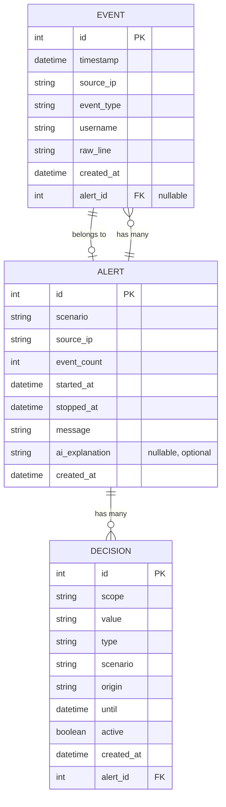

# Data Model — Sentinel Intrusion Detection

---

## Overview

This document defines the SQLite schema and data entities for Sentinel. The model supports the three Killer Tests and is optimized for synchronous, zero-delay ban enforcement via the Blocker middleware and background hygiene via the Expiry Sweeper.

- **Stack Engine**: SQLite 3 (using WAL journal mode for concurrent read/write performance).
- **Driver**: Python standard library `sqlite3` module exclusively (with WAL journal mode enabled). Third-party ORMs or async SQLite drivers (`aiosqlite`, SQLAlchemy) are explicitly excluded.

---

## ER Diagram



---

## Entities

### 1. EVENT

**Purpose**: Stores parsed log entries from `portal_auth.log`.

| Field | Type | Required | Default | Constraints | Description |
|---|---|---|---|---|---|
| `id` | INTEGER | yes | AUTOINCREMENT | PRIMARY KEY | Unique event identifier |
| `timestamp` | TEXT | yes | | ISO 8601 string | When the auth attempt occurred |
| `source_ip` | TEXT | yes | | INDEXED | Client IP extracted from socket / header |
| `event_type` | TEXT | yes | | INDEXED | `failed_login` or `successful_login` |
| `username` | TEXT | no | NULL | | Username submitted during login |
| `raw_line` | TEXT | no | NULL | | Full original log line |
| `created_at` | TEXT | yes | CURRENT_TIMESTAMP | | Creation timestamp |
| `alert_id` | INTEGER | no | NULL | FOREIGN KEY → ALERT(id) | Associated alert if part of an incident |

**Indexes**:
- `CREATE INDEX idx_event_ip_time ON event(source_ip, timestamp);`
- `CREATE INDEX idx_event_alert_id ON event(alert_id);`

---

### 2. ALERT

**Purpose**: Records detected intrusion events and security incidents.

| Field | Type | Required | Default | Constraints | Description |
|---|---|---|---|---|---|
| `id` | INTEGER | yes | AUTOINCREMENT | PRIMARY KEY | Unique alert identifier |
| `scenario` | TEXT | yes | | INDEXED | e.g. `brute_force_login` |
| `source_ip` | TEXT | yes | | INDEXED | Attacking IP address |
| `event_count` | INTEGER | yes | | | Number of failed events in window |
| `started_at` | TEXT | yes | | ISO 8601 string | First failed event in detection window |
| `stopped_at` | TEXT | yes | | ISO 8601 string | Trigger event timestamp |
| `message` | TEXT | no | NULL | | Summary message |
| `ai_explanation`| TEXT | no | NULL | | AI-generated summary (if AI_API_KEY set) |
| `created_at` | TEXT | yes | CURRENT_TIMESTAMP | | Alert creation timestamp |

**Indexes**:
- `CREATE INDEX idx_alert_source_ip ON alert(source_ip);`
- `CREATE INDEX idx_alert_created_at ON alert(created_at);`

---

### 3. DECISION

**Purpose**: Core enforcement records for bans. Evaluated by Blocker middleware on every incoming request.

| Field | Type | Required | Default | Constraints | Description |
|---|---|---|---|---|---|
| `id` | INTEGER | yes | AUTOINCREMENT | PRIMARY KEY | Unique decision identifier |
| `scope` | TEXT | yes | "ip" | | Target scope (always `"ip"`) |
| `value` | TEXT | yes | | INDEXED | Banned IP address |
| `type` | TEXT | yes | "ban" | | Decision type (`"ban"`) |
| `scenario` | TEXT | yes | | | Triggering scenario name |
| `origin` | TEXT | yes | "sentinel" | | Originator of decision |
| `until` | TEXT | yes | | INDEXED | Exact ISO 8601 expiration timestamp |
| `active` | INTEGER | yes | 1 | INDEXED | 1 = active, 0 = expired/revoked |
| `created_at` | TEXT | yes | CURRENT_TIMESTAMP | | Record creation timestamp |
| `alert_id` | INTEGER | no | NULL | FOREIGN KEY → ALERT(id) ON DELETE CASCADE | Parent alert (NULL for manual bans via POST /v1/decisions) |

**Indexes**:
- `CREATE INDEX idx_decision_enforce ON decision(value, until);`
- `CREATE INDEX idx_decision_active_until ON decision(active, until);`

---

## Critical Query Patterns

### 1. Middleware Enforcement Check (Per-Request)
On every request, the Blocker evaluates whether the client IP has an unexpired ban:
```sql
SELECT until FROM decision 
WHERE value = :client_ip 
  AND type = 'ban' 
  AND until > :current_timestamp_utc
ORDER BY until DESC 
LIMIT 1;
```
If a row is returned, the middleware returns `HTTP 403` with the `until` value. This ensures **exact, sub-second unblocking** the moment `now >= until`.

### 2. Expiry Sweeper Cleanup (Periodic)
The background sweeper updates expired rows to keep indexes clean:
```sql
UPDATE decision 
SET active = 0 
WHERE active = 1 
  AND until <= :current_timestamp_utc;
```
The sweeper is strictly for cleanup and database hygiene; enforcement does not depend on it.

### 3. Attack Detection Sliding Window
When processing new events, the detector counts failed attempts within the sliding window:
```sql
SELECT COUNT(*) FROM event 
WHERE source_ip = :ip 
  AND event_type = 'failed_login' 
  AND timestamp >= :window_start_utc;
```
(Maintained via in-memory sliding window queue and flushed to SQLite upon alert generation).
